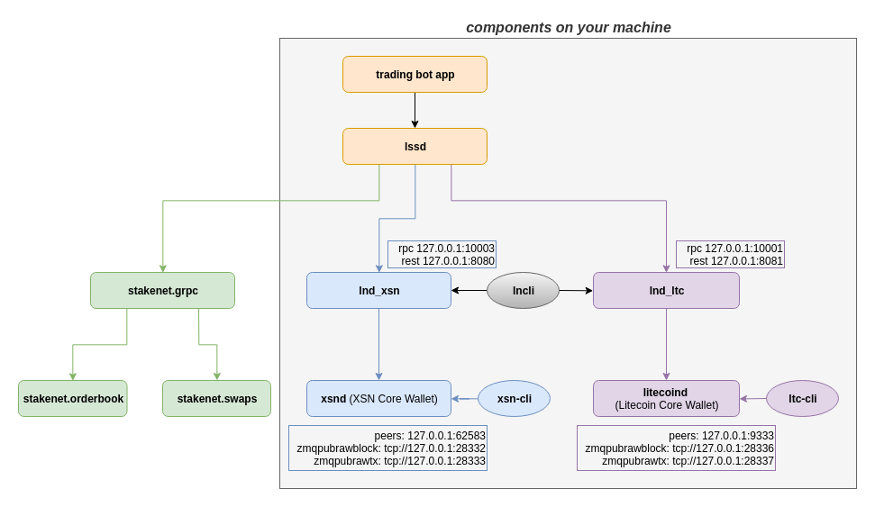

# go-dex-trading-bot

A trading bot for Stakenet's XSN DexAPI (Decentralized Exchange) written in golang.

The official XSN DexAPI with a trading bot written in Scala can be found here: [**github.com/X9Developers/DexAPI**](https://github.com/X9Developers/DexAPI).

It also has an extensive documentation how to set up all the required components on your machine which is mandatory to get this bot running, since this repository only provides an alternative trading bot implementation.

## Components

## Run the bot
Download the bot binary from the release and execute the binary `./bot` which will automatically pick up the `cfg.json` and connect to the lssd, read the lnd the certificates from the path specified in the config.
By default, it will print the current orderbook in console, followed by placing orders, if you have any orders specified in the cfg.json. 

## Create stub via protoc
Use the following link to install the prerequisites ([**https://grpc.io/docs/quickstart/go/**](https://grpc.io/docs/quickstart/go/)):

1. install `protoc compiler` (3.6.1+) 
2. install `protoc-gen-go` compiler plugin 

#### Generate a stub by using the lssdrpc.proto file
The latest **lssdrpc.proto** file can be found on: 
[**github.com/X9Developers/DexAPI/releases**](https://github.com/X9Developers/DexAPI/releases)

This **lssdrpc.proto** has to be copied to the `lssdrpc` directory and the following commands have to be executed.

Go to the project root, execute the following command to generate a go client for the lssdrpc API:

1. `cd lssdrpc/`

2. `protoc -I . lssdrpc.proto --go_out=plugins=grpc:.`

which will output a **lssdrpc.rb.go** that has client and server connectors automatically generated.

